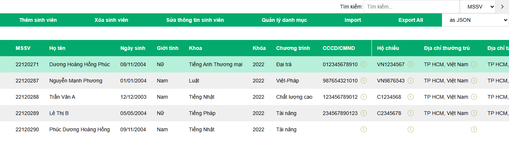
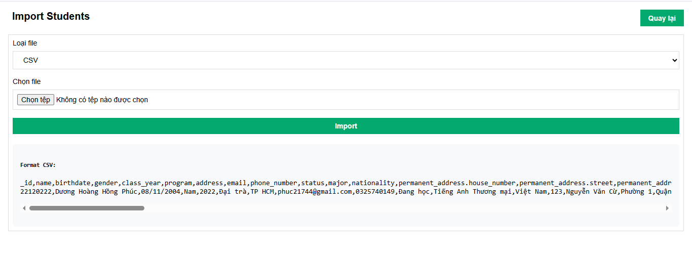

# Trang web Quản lý sinh viên (bản cập nhật cho Bài tập 5)
## Giới thiệu
Là trang web quản lý sinh viên đơn giản, cung cấp các chức năng thêm, xóa, sửa thông tin sinh viên, import, export, v.v

Sử dụng [Node.js](https://nodejs.org/), [Express.js](https://expressjs.com/), [MongoDB](https://www.mongodb.com/), [EJS](https://ejs.co/)

## Cấu trúc source code
```bash
/
├── config 
│   ├── db.js
│   └── bussiness_rules.json
├── controllers 
├── helpers 
├── models 
├── node_modules
├── middlewares
│   ├── log-middleware.js
│   └── validator-middleware.js
├── public
│   ├── css
│   ├── images
│   └── javascripts
├── routes
├── views
├── app.js
├── seeder.js
```

`app.js` là file chính của chương trình, chứa cấu hình của server và các route xử lý request từ client.

`public` chứa các file css để định kiểu, javascript để cung cấp tương tác và images để chứa các hình ảnh của trang web.

`routes` chứa file xử lý request từ client như GET, POST, PUT, DELETE.

`views` chứa các file html của chương trình. Các file này được viết bằng EJS.

`seeder.js` thêm dữ liệu mẫu vào database.

`config` chứa các file cấu hình của chương trình. Gồm:
+ `db.js`: cấu hình và thiết lập kết nối với MongoDB database
+ `bussiness_rules.json`: chứa các quy ước và việc kiểm tra tính hợp lệ của dữ liệu trước khi lưu vào database.

`controllers` chứa các file xử lý các thao tác của business logic.

`helpers` chứa các file hỗ trợ hoạt động chính của chương trình (thay đổi định dạng dữ liệu, log các xử lý,...).

`models` chứa các model dữ liệu (bảng) của MongoDB.

`middlewares` chứa các file xử lý middleware của chương trình. Bao gồm:
+ log-middleware: để lưu lại các xử lý vào các file log
+ validator-middleware: để kiểm tra tính hợp lệ của dữ liệu trước khi thực hiện các xử lý. Sử dụng `bussiness_rules.json`

## Hướng dẫn cài đặt & chạy chương trình
### Yêu cầu

NodeJS phiên bản từ v20.17.0 trở lên.

### Cài đặt & chạy chương trình

Tiến hành cài đặt các module cần thiết:

```bash
npm install
```

Chạy chương trình:

```bash
npm run dev
```

## Screenshots

## Trang chính 

Trang chính hiển thị danh sách và thông tin chi tiết của tất cả các sinh viên.  
Có 3 chế độ làm việc trên danh sách và có thể được truy cập qua thanh công cụ phía trên của trang:
+ *Thêm sinh viên*
+ *Sửa thông tin sinh viên*
+ *Xóa sinh viên*

Các trường của sinh viên được hiển thị chi tiết ở từng dòng của sinh viên tương ứng. Các trường có nút `(i)` ở bên cạnh là các trường có thể được viết gọn và có thể xem chi tiết khi nhấn vào nút đó.  

Ví dụ, các trường như CMND/CCDD hay Hộ chiếu được viết gọn bằng mã số và có thể xem chi tiết các trường liên quan như *Ngày cấp*, *Nơi cấp*, v.v khi nhấn vào nút `(i)`.



### Thêm sinh viên

Ở chế độ này, người dùng nhập thông tin sinh viên mới qua dòng nhập liệu đầu danh sách. Nhập đầy đủ các trường của sinh viên và nhấn vào nút *Lưu* trên thanh công cụ để thêm sinh viên mới.  


Nhấn *Hủy* để hủy bỏ thao tác thêm sinh viên.

### Xóa sinh viên

Ở chế độ xóa, danh sách sinh viên có thêm một checkbox ở mỗi dòng. Người dùng chọn vào các sinh viên muốn xóa, sau đó nhấn *Xác nhận xóa* trên thanh công cụ để xóa các sinh viên đã chọn.


Nhấn *Hủy* để hủy bỏ thao tác xóa sinh viên.

### Sửa thông tin sinh viên

Ở chế độ sửa, người dùng có thể sửa thông tin của sinh viên bằng cách nhấn vào dòng của sinh viên muốn sửa. 
Thông tin của sinh viên sẽ được hiển thị ở phần nhập liệu đầu danh sách. Người dùng sửa thông tin sinh viên và nhấn *Lưu* để lưu thông tin mới.


Nhấn *Hủy* để hủy bỏ thao tác sửa thông tin sinh viên.

## Trang import

Trang import giúp thêm sinh viên từ file `CSV` hoặc `JSON`. Để truy cập trang này, nhấn vào nút *Import* trên thanh công cụ của trang chính.



Các bước thêm sinh viên từ file:
+ Chọn *Loại file* import từ menu dropdown
+ Chọn file cần import từ thiết bị
+ Nhấn *Import* để thêm sinh viên từ file

Để quay lại trang chính, nhấn vào nút *Quay lại* ở góc trên bên phải của trang.

**Lưu ý**:
+ Đảm bảo các file theo đúng định dạng được ví dụ ở phần *Format CSV* hoặc *Format JSON* ở phía dưới nút *Import*
+ Các thông báo lỗi sẽ hiển thị ở phía dưới nút *Import* nếu có lỗi xảy ra. Sinh viên có thể không thêm vào danh sách nếu thông tin không hợp lệ hoặc đã tồn tại


## Trang quản lý danh mục

Đây là trang giúp thêm, xóa, sửa các danh mục có sẵn cho một số trường của sinh viên, bao gồm: *Tình trạng*, *Khoa* và *Chương trình*.


Ở mỗi trường, các danh mục có sẵn được liệt kê ở dạng danh sách. Mỗi dòng bao gồm mã danh mục và tên. Ví dụ:
`KHOATOAN - 'Toán'`, `TTTN - 'Tốt nghiệp'`, `CTDT - 'Đại trà'`.

### Thêm danh mục
Thêm danh mục bằng cách nhập mã danh mục và tên vào dòng nhập liệu dưới danh sách. Nhấn vào nút **+** bên phải để thêm danh mục mới.

### Xóa danh mục
Để xóa danh mục, nhấp vào nút **-** bên phải các danh mục được liệt kê

### Đổi tên danh mục
Tên danh mục có thể đổi trực tiếp bằng cách nhập tên mới vào ô tên của danh mục và nhấn `Enter`.


## Export danh sách sinh viên


Danh sách sinh viên có thể được xuất ra file để lưu trữ bằng cách:
+ Chọn kiểu file muốn xuất ra: `CSV` hoặc `JSON`, từ menu dropdown
+ Nhấn vào nút *Export All* để xuất ra file

## Unit testing
- **Công cụ sử dụng**
Nhóm sử dụng Jest, một công cụ test JavaScript phổ biến, để thực hiện các testcase. Jest cung cấp một môi trường test linh hoạt và mạnh mẽ, cho phép viết và chạy các testcase một cách dễ dàng.
- **Phương pháp test**
Nhóm đã thực hiện các testcase theo phương pháp sau:
Viết các testcasetrong file `student.test.js` cho từng chức năng của hệ thống, bao gồm thêm mới sinh viên, tìm kiếm sinh viên, cập nhật thông tin sinh viên, xóa sinh viên, nhập dữ liệu từ JSON.Sử dụng Jest để chạy các testcase và kiểm tra kết quả.
- **Cách thực hiện**:
 ```bash
  npm install #(để cài đặt các package cần thiết trong `package.json`)

  npm run test (để chạy các testcase)
```
-  **Kết quả**
  

